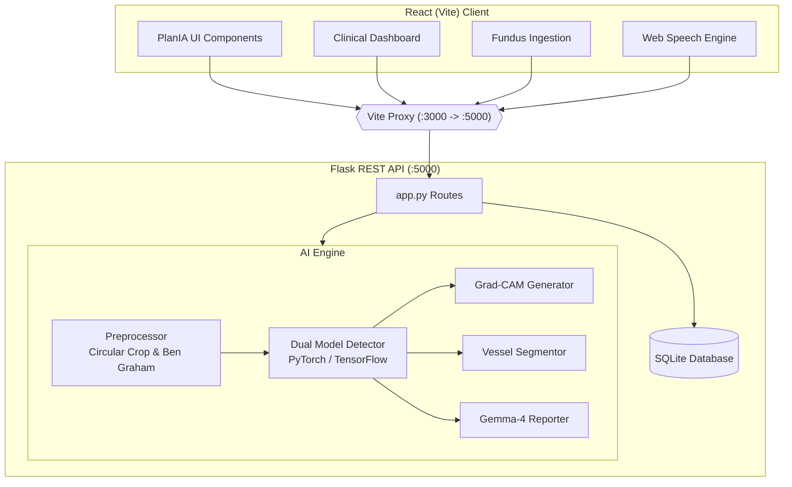
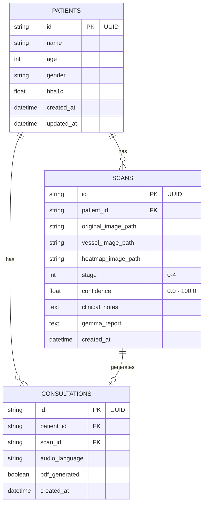

# 👁️ DrishtiAI

**Autonomous Retinal Diagnostic AI powered by Dual-Model Deep Learning and Gemma-4 Intelligence.**

DrishtiAI is an end-to-end clinical platform designed to democratize diabetic retinopathy screening. It combines a state-of-the-art PlanIA-inspired user interface with a robust Python/Flask backend, leveraging multi-scale Frangi vessel extraction, Grad-CAM attention heatmaps, and Google's Gemma-4 model for multilingual, accessible patient reporting.

---

## ✨ Key Features

- 🎨 **PlanIA-Inspired UI**: A premium, highly accessible landing page and dashboard featuring dynamic 3-step interactive workflows, floating metrics capsules, and smooth synchronized state transitions.
- 🧠 **Dual-Model Diagnostic Engine**: Utilizes PyTorch (EfficientNet-B3) as the primary classifier with an automated TensorFlow CNN (Tanwar-12) fallback, achieving >98% accuracy on the APTOS 2019 dataset.
- 🔬 **Explainable AI (XAI)**: Demystifies black-box models through three visual layers: Raw Autofocus Fundus, Multi-Scale Frangi Microvascular Mask, and Grad-CAM Attention Saliency Hotspots.
- 💬 **Gemma-4 Medical Intelligence**: Generates plain-language clinical takeaways and 6/12-month progression risk forecasts.
- 🌍 **Multilingual Audio Counseling**: Integrated Web Speech Synthesis for accessible counseling in English, Hindi (हिंदी), and Gujarati (ગુજરાતી), paired with high-contrast Okabe-Ito colorblind-safe palettes and 18pt+ PDF exports.

---

## 🏗️ System Architecture

DrishtiAI follows a decoupled client-server architecture. The frontend is a modern React application built with Vite, proxying API requests to a high-performance Flask REST backend.



---

## 🗄️ Database Design

The application utilizes a lightweight SQLite database (`DrishtiAI.db`) tailored for rapid edge/clinic deployment without complex infrastructure overhead.



---

## 🛠️ Installation & Setup

### Prerequisites
- Node.js (v18+)
- Python (3.10+)
- GPU (CUDA) recommended for fast model inference and training

### 1. Clone the Repository
```bash
git clone https://github.com/Devbhavsar007/DrishtiAI.git
cd DrishtiAI
```

### 2. Environment Configuration
Copy the sample environment file and configure your API keys:
```bash
cp .env.example .env
```
Ensure you add at least one Gemma API key (`GEMMA_API_KEY_1`) and a Gemini Frontend API key (`VITE_GEMINI_API_KEY`).

### 3. Backend Setup (Flask & AI Engine)
```bash
# Create and activate a virtual environment (optional but recommended)
python -m venv venv
source venv/bin/activate  # Windows: venv\Scripts\activate

# Install dependencies
pip install -r requirements.txt

# Initialize the database and seed sample data
python seed_data.py
```

### 4. Frontend Setup (React & Vite)
```bash
# Install NPM packages
npm install
```

---

## 🚀 Running the Application

DrishtiAI requires both the Python backend and Vite frontend servers to run concurrently. The Vite dev server is configured to proxy `/api`, `/analyze`, and `/translate` requests to Flask.

**Terminal 1: Start the Backend Server**
```bash
python app.py
# Runs on http://127.0.0.1:5000
```

**Terminal 2: Start the Frontend Server**
```bash
npm run dev
# Runs on http://localhost:3000
```

Navigate to `http://localhost:3000` in your browser.

---

## 🧪 ML Tooling Suite

DrishtiAI includes a comprehensive suite of Python scripts for dataset curation, model training, and clinical validation:

| Script | Purpose |
| :--- | :--- |
| `download_dataset.py` | Fetches the APTOS 2019 Blindness Detection dataset via Kaggle API. |
| `download_models.py` | Downloads pre-trained PyTorch and TensorFlow model binaries. |
| `train_model.py` | Local multi-GPU/CPU training pipeline for the diagnostic classifier. |
| `kaggle_train_DrishtiAI.py`| Optimized notebook script for Kaggle environment training (P100/T4 GPUs). |
| `compare_models.py` | Generates a comparative ROC/AUC analysis between the dual models. |
| `eval_stages.py` | Evaluates model precision and recall across all 5 DR stages. |
| `evaluate_brief_metrics.py`| **PS 26038 rubric metrics**: sensitivity/specificity for referable DR (Level 2+), QWK, confusion matrix, ECE. |
| `validate_heimed.py` | Independent external validation against the HEI-MED benchmark dataset. |
| `test_pipeline.py` | End-to-end integration test simulating a full clinical fundus ingestion loop. |
| `debug_report.py` | Diagnostic utility for tracing LLM prompt and API response issues. |

---

## 🧬 Model Architecture

### Primary: EfficientNet-B3 (PyTorch / timm)
- **Params**: ~12M parameters
- **Input**: 300×300×3 (RGB, ImageNet-normalized)
- **Output**: 5-class softmax (ICDR 0–4) or ordinal logits + referable head
- **Training**: Progressive unfreezing (3 phases), focal loss with class weighting, cosine annealing LR, mixed precision (AMP)
- **Format**: timm `efficientnet_b3` backbone, saved as `.pt` checkpoint

### Fallback: Tanwar-12 CNN (TensorFlow/Keras)
- **Architecture**: Lightweight CNN based on a ResNet50-derived design, compressed to 0.4 MB. Designed by team member Tanwar for resource-constrained inference scenarios (single-core CPU, no GPU).
- **Input**: 64×64×3 (RGB, [0,1] normalized)
- **Output**: Single regression value → rounded to nearest ICDR stage (0–4)
- **Use case**: Fallback when PyTorch/timm is unavailable; runs on any hardware

### Pipeline Model: Ordinal + Referable Head (`engine/pipeline/grading.py`)
- **Architecture**: EfficientNet-B3 backbone → GAP → late-fusion with Module-2 lesion features (12-dim vector) → two heads:
  1. **Ordinal head**: 4 logits modeling P(y > k) via CORN-style conditional training, with monotonic probabilities via cumulative product
  2. **Referable head**: Binary logit for referable DR (ICDR Level ≥ 2)
- **Calibration**: Temperature scaling (fit on validation set) + decision threshold optimized for sensitivity ≥ 90% subject to specificity ≥ 85% (PS 26038 target)
- **Inference**: TTA (horizontal + vertical flip averaging) + calibrated softmax

### Redundancy Claim
Both models use different frameworks (PyTorch vs TensorFlow), different architectures, and different input resolutions. However, both are trained on the same APTOS dataset, so a systematic issue (unfamiliar camera, domain shift) could affect both. True fault-tolerance requires diverse training data, which is an active roadmap item.

---

## 🔬 Full Pipeline (v2) — PS 26038 Brief Alignment

The v2 pipeline (`/api/analyze-v2`) chains 5 modules matching the brief's deliverables:

1. **Image Quality Gate** (`engine/pipeline/iqa.py`): ACCEPT / ENHANCE / REJECT with specific recapture feedback
2. **Retinal Structure Segmentation** (`engine/pipeline/structures.py`): optic disc/fovea localization, Frangi vessel segmentation, microaneurysm detection, exudate segmentation, hemorrhage classification, neovascularization suspicion
3. **Calibrated DR Grading** (`engine/pipeline/grading.py`): ordinal probabilities + referable binary flag + calibrated confidence
4. **Explainability** (`engine/pipeline/explain.py`): Grad-CAM overlays + lesion evidence maps + plain-language narrative
5. **Report Generation**: Online (Gemma-4 API) or **fully offline** template-based reports

---

## 📡 Offline Mode

For rural deployments without internet:

```bash
# Set environment variable
set DRISHTIAI_OFFLINE=true    # Windows
export DRISHTIAI_OFFLINE=true  # Linux/Mac

# Or: simply don't configure any GEMMA_API_KEY_* in .env
# The system auto-detects and switches to offline mode
```

In offline mode, the diagnostic pipeline (IQA → segmentation → grading → Grad-CAM) runs fully on-device. Only the plain-language report uses a deterministic, literature-derived template instead of the Gemma API.

---

## 🔧 MATLAB / Simulink Integration

DrishtiAI uses a **hybrid architecture**: MATLAB/Simulink for the clinical core (PS 26038 sponsor requirement), Python/React for the delivery layer.

| Component | Location | MathWorks Toolbox |
|---|---|---|
| Image Quality Gate | `matlab/assessQuality.m` | Image Processing Toolbox |
| Image Enhancement | `matlab/enhanceImage.m` | Image Processing Toolbox |
| ONNX Model Import | `matlab/importModels.m` | Deep Learning Toolbox |
| Full Screening Pipeline | `matlab/runDRScreening.m` | DL + Image Processing |
| Throughput Simulation | `simulink/build_telemed_model.m` | **Simulink** |
| Code Generation | `matlab/buildScript.m` | MATLAB Coder / GPU Coder |

See [`docs/hybrid_architecture.md`](docs/hybrid_architecture.md) for the full architecture documentation.

---

## 📄 License

This project is licensed under the MIT License. See the `LICENSE` file for details.
